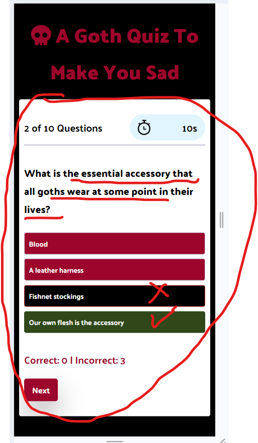

# [GOTH QUIZ](https://craigdickerson725.github.io/goth-quiz)

*Welcome to A Goth Quiz To Make You Sad!  The goal of this quiz is to give goths and non-goths alike a silly quiz to test your knowledge of goth culture.  The correct answers within the questions aren't exactly informative in and of themselves, but rather the names and songs in the answer options are intended to introduce names of people, albums, and songs that are important to the goth scene as we know it.  So put on your black lipstick and your best skull rings, and dive headfirst into this fun goth quiz!

source: [amiresponsive](https://ui.dev/amiresponsive?url=https://craigdickerson725.github.io/goth-quiz)

## UX

The design process was quite simple, actually.  The goal was to create a game with a well-known 'quiz-show' format to give those goth kids out there something to do in the spare time they have between sleeping all day and dancing badly in burned-out goth clubs late at night.  The goal was to display the name of the game above the question area.  The question area itself holds the bulk of the content, and almost all of the interactive features.

### Colour Scheme

The color scheme holds to the goth love of red and black.  The reds, of course, needed to be dark, like a mix between crimson and red wine.  In contrast, white was used to make the background of the question area and stand out like a beacon, cutting through the darkness of a black page.  Text is found sometimes in black, and sometimes in white...representing the duality of man (or something like that).   Actually, the text colors were alternated depending on which color makes them easier to read at any given time.  Also, after the user chooses an answer, the correct answer is given a dark green background, to give off an earthy, witchy-vibe.  If an incorrect answer is chosen, the correct is given a dark green color, and the incorrect a black background color.Here is a rundown of the colors used:

- `#9d062c` used for primary text.
- `#ffffff` used for quiz area background.
- `black` used for page background.
- `white` used for option text.
- `#2f4719` used for correct answer background color.
- `black` used for incorrect answer background color.

### Typography

- [Palanquin Dark](https://fonts.google.com/specimen/Palanquin+Dark) was used for all texts.

- [Font Awesome](https://fontawesome.com) is where the super-scary skull icon used in the header came from.

- [UXWing](https://uxwing.com) was used to get the fancy timer icon.

## User Stories

User Stories for A Goth Quiz To Make You Sad focuses more on the goth quiz users, who are assumed to be new users, as this is a brief quiz game (intended for use within another website, for example) and most likely won't be played more than a couple of times by each user.

### Goth Quiz Users

- As a goth quiz user, I would like to see a clear heading, so that I can understand what the game is about.
- As a goth quiz user, I would like to clearly see the question and options, so that I can quickly read what is being asked and promptly choose one of the answer options.
- As a goth quiz user, I would like to see the correct answer highlighted, so that I can learn the correct answer in the case that my selection was wrong.
- As a goth quiz user, I would like to have a timer, so that I can experience a fun sense of competition and urgency in the game.
- As a goth quiz user, I would like to have a score tracker, so that I can see how many correct vs incorrect answers I have at any point during the game.
- As a goth quiz user, I would like to have a message at the end of the game, so that I feel rewarded for a job well done (or chastised for doing a terrible job).

## Wireframes

To follow best practice, wireframes were developed for mobile and tablet/desktop screens.
I've used [Balsamiq](https://balsamiq.com/wireframes) to design my site wireframes.

### Mobile Wireframes

 Click here to see the Mobile Wireframes 

Begin Screen
  - 

Question Screen
  - 

Score Tally/Final Message Screen
  - 

### Desktop and Tablet Wireframes

 Click here to see the Tablet Wireframes 

Begin Screen
  - 

Question Screen
  - 

Score Tally/Final Message Screen
  - 

## Features

### Existing Features

- **The Begin Button**

    - The begin screen has a welcome message, and the Begin Button is there to start the game when the user is ready.

- **The Question Area**

    - The main feature of the site would be the questions themselves.  When the begin or next button is clicked, the user is presented with a question.  There are four clickable options...once a choice is made, the correct choice is highlighted in green, and if the user has chosen an incorrect answer, that is given a black background.  When a choice is made, all of the options are disabled until the Next button is clicked and a new question begins.

- **The Timer**

    - The timer is featured on the top right hand corner of the question area.  The user is given 25 seconds to answer each question.  If the timer runs out, the question is considered incorrect.

- **The Score Tracker**

    - The score tracker keeps track of how many correct answers versus incorrect answers that the user has at any point during the 10-question quiz. 

- **The Question Tracker**

    - The question tracker keeps track of which number out of 10 questions the user is on.  This is a way for the user to know how many questions they have already answered, and how many remain.

- **The Next Button**

    - The next button advances to the next question (or to the end of the game, if all 10 questions have been presented.  If the user does not make an answer selection before clicking the next button, then it is considered an incorrect answer.

- **The Score Tally/Final Message**

    - When the quiz is finished, the score tally is presented to the user, along with a message which either a) praises the user for their impressive goth knowledge, or b) chastises them for their lack of goth knowledge.  

- **The Restart Button**

    - When the game is finished, and the user has been presented with their score and final message of encouragement (or discouragement), then a new quiz can be started by clicking the restart button.

### Future Features

- MORE QUESIONS FOR THE QUIZ
    - It would be more interesting to either extend the quiz, or to have a larger question pool, to give the game some replay value.
- A LINK TO A GOTH PLAYLIST
    - For those truly interested in the various musical genres associated with the goth scene, a link to a playlist would be a great addition.

## Tools & Technologies Used

In making this goth quiz I used many resources.  For 

-  used to generate README and TESTING templates.  This README would not have been possible without it.
-  used for version control. (`git add`, `git commit`, `git push`)
-  used for secure online code storage.
-  used as a cloud-based IDE for development.
-  used for hosting the deployed front-end site.
-  used for creating wireframes.
-  used for the skull icon.
-  used to help debug, troubleshoot, and explain things, as well as getting coding suggestions (most of which did not work, but some were very useful).

## Testing

> [!NOTE]  
> For all testing, please refer to the [TESTING.md](TESTING.md) file.

## Deployment

The site was deployed to GitHub Pages. The steps to deploy are as follows:

- In the [GitHub repository](https://github.com/craigdickerson725/goth-quiz), navigate to the Settings tab 
- From the source section drop-down menu, select the **Main** Branch, then click "Save".
- The page will be automatically refreshed with a detailed ribbon display to indicate the successful deployment.

The live link can be found [here](https://craigdickerson725.github.io/goth-quiz)

### Local Deployment

This project can be cloned or forked in order to make a local copy on your own system.

#### Cloning

You can clone the repository by following these steps:

1. Go to the [GitHub repository](https://github.com/craigdickerson725/goth-quiz) 
2. Locate the Code button above the list of files and click it 
3. Select if you prefer to clone using HTTPS, SSH, or GitHub CLI and click the copy button to copy the URL to your clipboard
4. Open Git Bash or Terminal
5. Change the current working directory to the one where you want the cloned directory
6. In your IDE Terminal, type the following command to clone my repository:
	- `git clone https://github.com/craigdickerson725/goth-quiz.git`
7. Press Enter to create your local clone.

Alternatively, if using Gitpod, you can click below to create your own workspace using this repository.

Please note that in order to directly open the project in Gitpod, you need to have the browser extension installed.
A tutorial on how to do that can be found [here](https://www.gitpod.io/docs/configure/user-settings/browser-extension).

#### Forking

By forking the GitHub Repository, we make a copy of the original repository on our GitHub account to view and/or make changes without affecting the original owner's repository.
You can fork this repository by using the following steps:

1. Log in to GitHub and locate the [GitHub Repository](https://github.com/craigdickerson725/goth-quiz)
2. At the top of the Repository (not top of page) just above the "Settings" Button on the menu, locate the "Fork" Button.
3. Once clicked, you should now have a copy of the original repository in your own GitHub account!

### Local VS Deployment

After quite a bit of playing through the quiz and testing the local preview and the actual deployed site, there were no noticeable differences found between the two.

## Credits

This project would not have been possible if I had been left to fend for myself with only my minimal experience in javascript.  The following subsections will give the old 'tip o' the hat' to those sources who brought my quiz to life.

### Content

I would like to note that I leaned very heavily on the javascript written by Coding Torque on their "Quiz App Using JavaScript".  This is credited and linked below.  I used it as a guide to get the javascript working, however I saw early on that much would have to be changed to make it function more efficiently (and to make it do more of what I wanted).  When you check out the Coding Torque site, you will see the similarities, but will also see just how much needed to change to make it actually function like a proper quiz game.  I am deeply appreciative of the Coding Torque site's tutorial for the quiz game, and I did learn much from it, so check it out for yourself...they have many other projects that seem like fun ideas!

| Source | Location | Notes |
| --- | --- | --- |
| [Markdown Builder](https://tim.2bn.dev/markdown-builder) | README and TESTING | tool to help generate the Markdown files |
| [Coding Torque](https://codingtorque.com/quiz-app-using-javascript/) | quiz app using javascript | mainly for the skeleton of setting up the javascript |
| [YouTube](https://www.youtube.com/watch?v=f4fB9Xg2JEY&list=WL&index=3&t=10s) | quiz area | finding javascript ideas for the question buttons and answer checker |
| [ChatGPT](https://chatgpt.com/) | code correction, debugging | provided many ideas for taking the ideas I used from Coding Torque and changing/improving them to meet my own needs for the final outcome of the quiz |

### Media

Outside of the timer and skull icons that have already been credited, there is no additional media being used in this quiz

### Acknowledgements

The following people were instrumental in the creation of this quiz, and they are worthy of their props:

- I would like to thank my Code Institute mentor, [Tim Nelson](https://github.com/TravelTimN) for his support throughout the development of this project.  Many of the improvements made to the code came from our appointments, without which the site would most likely not function at all.  Also, without his markdown generator, there would be no readme or testing files.
- I would like to thank the [Code Institute](https://codeinstitute.net) tutor team for their assistance with troubleshooting and debugging some project issues.
- I would like to thank my wife and daughter for allowing me the insane amount of time it took to create this, and for being kind enough to play the quiz on their phones and tablets.