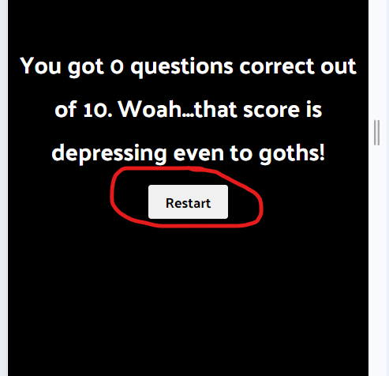

# Testing

> [!NOTE]  
> Return back to the [README.md](README.md) file.

Testing for A Goth Quiz To Make You Sad was mainly undertaken by myself, and a rag-tag pair of 'go-getters' that I like to call Cindy, Bea, Julia, and Fini.  While Julia and Fini played the game repeatedly on their tablets, Cindy and Bea played through the game on their phones.  I played the game myself on all devices repeatedly throughout.  Each feature (as listed and illustrated on the README page) seemed to work fine for all of us--in effect, the game functions as we hoped that it would.

- **Begin Button**

The begin button starts the game.  When clicked, it brings up the question area, and starts the countdown, giving the user 25 seconds to read the question and choose the correct answer option.  The button is easy to find, quickly responds to the click, and functions properly.

- **Question Area**

The question area is where the question is displayed, along with a question-counter, a timer, answer options (represented by clickable buttons), a score-tracker, and a next button.  The question is presented to the user, and the user has 25 seconds to read the questions and choose their answer by clicking one of the four options.  After the user's selection, the correct option is highlighted in green, and if an incorrect choice was made, it is given a black background.  All buttons are disabled after a selection is made.  This all functions as hoped.

- **The Timer**

A timer appears in the upper right corner of the question area and is represented by a nifty stopwatch icon.  The timer gives the user 25 seconds to answer the question.  If the user has not made a selection before the timer runs out, then all buttons are disabled, the correct answer is given a green background, and the incorrect score on the score tracker is incremented by 1.  This works as intended.

- **Score Tracker**

The score tracker (located at the bottom left of the question area) keeps a record of how many questions the user has gotten correct, as well as how many questions they have answered incorrectly. This works as hoped.

- **Question Tracker**

The question tracker in the upper-left corner of the question area shows the user which question they are actually on.  The format is which question number out of 10 total questions they are on.  This works as intended.

- **Next Button**

The next button (located at the very bottom-left of the question area) advances to the next question, or to the final score tally if the user has answered all the questions.  When an answer  is selected, all buttons are disabled, and the game cannot continue to the next question until the user clicks Next.  This is also true when the timer runs out before an answer is selected.  This functions as intended.

- **Score Tally**

When the user has answered all 10 questions, the next button will take the user to the score tally.  This shows the user how many questions out of 10 that they answered correctly.  It also gives the user an encouraging statement if they've performed well, and derides and humiliates the user if they have botched the quiz.  This works as intended.

- **Restart Button**

The restart button appears at the score tally screen.  It gives the user a chance to begin the game anew, in case they didn't get enough the first time.  This functions as hoped.

User Experience Testing:

- Usability Testing: The small group of testers all gave positive feedback on the functionality of the game.  However, the one item of negative feedback was the shortness of the timer.  Initially, the timer was set for 10 seconds...which, for non-goths, is not enough time to make a decision on which answer was correct.  I took this to heart, and changed the timer to allow 25 seconds for the decision...which, if you do the math, is more than double the original time.  This change was met with much rejoicing (bless my black heart).

- Accessibility Testing: The first style setup featured black text in the question screen, which was very difficult to see.  I changed this to white text, and also used a darker red to make the text in the options stand out more clearly...so even the old weak-eyed goths (like me) can read it.

Regression Testing:

Before my rag-tag group of testers got hold of the goth quiz, there was a bit of wonkiness with arranging what actually should happen in the event the timer ran down.  I experimented with changing it, and this caused other issues.  This is described in detail in the Bugs section at the end of this TESTING file.  Again, this was before any outsiders tested the program, so the only feedback on the issue was mine, and the issue was resolved with the help of my mentor, Tim.

## Code Validation

### HTML

I have used the recommended [HTML W3C Validator](https://validator.w3.org) to validate all of my HTML files.

| Directory | File | Screenshot | Notes |
| --- | --- | --- | --- |
|  | index.html |  | |

### CSS

I have used the recommended [CSS Jigsaw Validator](https://jigsaw.w3.org/css-validator) to validate all of my CSS files.

| Directory | File | Screenshot | Notes |
| --- | --- | --- | --- |
| assets | style.css |  | |

### JavaScript

I have used the recommended [JShint Validator](https://jshint.com) to validate all of my JS files.

| Directory | File | Screenshot | Notes |
| --- | --- | --- | --- |
| assets | script.js |  | |

| Directory | File | Screenshot | Notes |
| --- | --- | --- | --- |
| assets | script.js |  | |

## Browser Compatibility

I've tested my deployed project on multiple browsers to check for compatibility issues.

| Browser | Home | About | Contact | etc | Notes |
| --- | --- | --- | --- | --- | --- |
| Chrome |  |  |  | Works as expected |
| Firefox |  |  |  | Works as expected |
| Edge |  |  |  | Works as expected |

## Responsiveness

I've tested my deployed project on multiple devices to check for responsiveness issues.

| Device | Home | About | Contact | etc | Notes |
| --- | --- | --- | --- | --- | --- |
| Mobile (DevTools) |  |  |  | Works as expected |
| Tablet (DevTools) |  |  |  | Works as expected |
| Desktop |  |  |  | Works as expected |
| XL Monitor |  |  |  | Scaling starts to have minor issues |
| 4K Monitor |  |  |  | Noticeable scaling issues |

## Lighthouse Audit

I've tested my deployed project using the Lighthouse Audit tool to check for any major issues.

| Page | Mobile | Desktop | Notes |
| --- | --- | --- | --- |
| Begin Screen |  |  | Some minor warnings |
| Question Screen |  |  | Some minor warnings |
| Score Tally |  |  | Some minor warnings |

## User Story Testing

| User Story | Screenshot |
| --- | --- |
| As a goth quiz user, I would like to see a clear heading, so that I can understand what the game is about.. |  |
| As a goth quiz user, I would like to clearly see the question and options, so that I can quickly read what is being asked and promptly choose one of the answer options. |  |
| As a goth quiz user, I would like to see the correct answer highlighted, so that I can learn the correct answer in the case that my selection was wrong. |  |
| As a goth quiz user, I would like to have a timer, so that I can experience a fun sense of competition and urgency in the game. |  |
| As a goth quiz user, I would like to have a score tracker, so that I can see how many correct vs incorrect answers I have at any point during the game. |  |
| As a goth quiz user, I would like to have a message at the end of the game, so that I feel rewarded for a job well done (or chastised for doing a terrible job). |  |

## Bugs

In the topic of bugs, I did encounter a bug (which manifested itself in a couple of different ways as I tried to correct it).  Those manifestations were all quite minor, and only required javascript adjustments to fix, but if left uncorrected it would have hurt the user experience.  The bug was as follows: 

When the timer ran down, the next question was automatically loaded without counting it as incorrect or adjusting the score.  I looked through tutorials, and through ChatGPT and was able to put together a script that would count the score as incorrect, however, it did not disable the option buttons or highlight the correct answer.  My mentor Tim (as credited in the README) helped me to adjust the timer so that when the time runs out, 1) all the buttons are disabled, 2) the correct answer is highlighted, 3) the incorrect score is incremented by one, and 4) the Next button must be clicked to advance to the next question.

## Unfixed Bugs

> [!NOTE]  
> There are no remaining bugs that I am aware of.